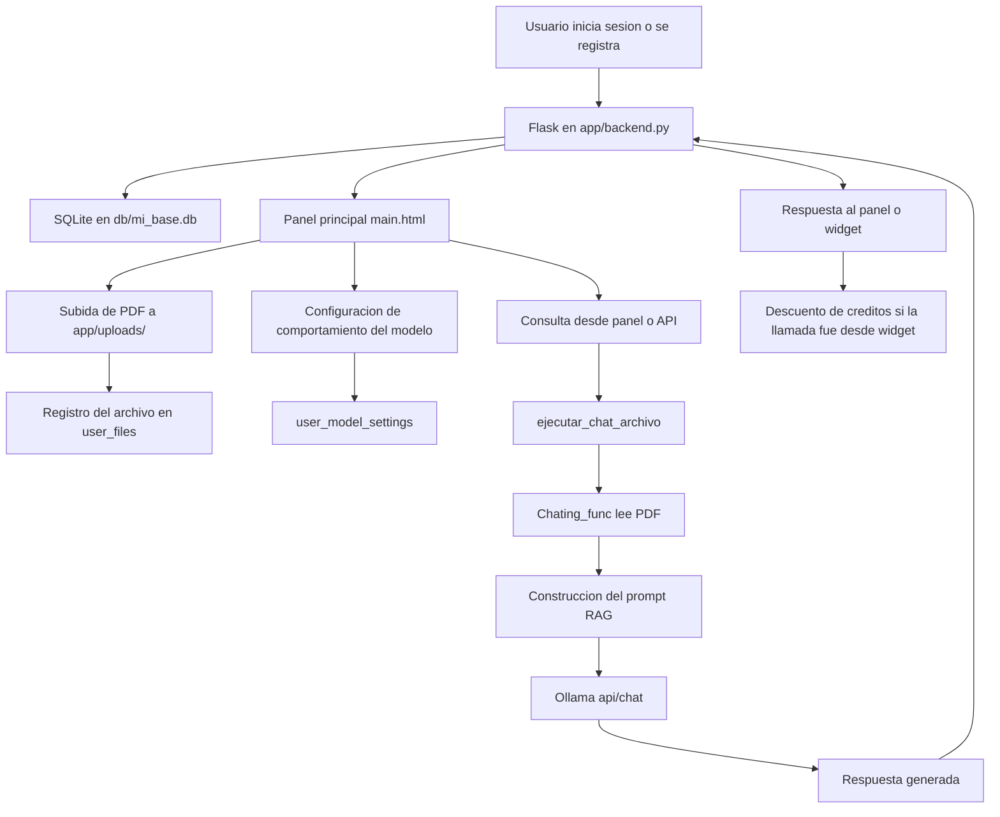

# Arquitectura funcional del software

Este documento describe como esta construido el software, que componentes existen actualmente, que hace cada uno y en que parte del sistema se usan.

## 1. Vision general

El proyecto implementa un asistente conversacional con enfoque RAG usando:

- Flask como servidor web y API.
- SQLite como base de datos local.
- Archivos PDF como fuente de contexto.
- Ollama como proveedor del modelo LLM local.
- HTML, CSS y JavaScript para la interfaz web y el widget embebible.

El flujo funcional principal es este:

1. Un usuario se registra o inicia sesion.
2. El sistema crea o consulta sus datos en SQLite.
3. El usuario sube archivos PDF al sistema.
4. Los PDF se registran en base de datos y se almacenan fisicamente en `app/uploads/`.
5. El usuario define opcionalmente un comportamiento del modelo.
6. Cuando el usuario o el widget hacen una consulta, el sistema toma el PDF activo, extrae su texto y lo envia junto con el prompt al modelo local en Ollama.
7. El sistema devuelve la respuesta generada.
8. Si la consulta viene desde el widget, se descuenta un credito al usuario propietario del token.

## 2. Componente principal que hace funcionar el software

### `app/backend.py`

Este es el archivo principal del sistema en su estado actual.

Responsabilidades:

- Crea la aplicacion Flask.
- Configura sesion, carpeta de subidas y URL de Ollama.
- Inicializa y corrige el esquema de base de datos.
- Gestiona autenticacion y sesion.
- Administra usuarios, roles, creditos y tokens del widget.
- Gestiona archivos PDF por usuario.
- Guarda la configuracion de comportamiento del modelo.
- Expone rutas HTML para panel, login, pruebas y descargas.
- Expone rutas API para archivos, chat y widget.
- Conecta con `Chating_func` para construir la peticion RAG.
- Conecta con Ollama por HTTP usando `requests.post(...)` hacia `http://127.0.0.1:11434/api/chat`.

En otras palabras: si `backend.py` no esta corriendo, el software completo no funciona.

## 3. Modulos auxiliares y donde se usan

### `app/general_func/BD_conn.py`

Funcion:

- Encapsula la conexion a SQLite.
- Crea la ruta de la base de datos si no existe.
- Ejecuta consultas SQL con bloqueo de hilo (`threading.Lock`) para evitar conflictos de concurrencia basicos.

Donde se usa:

- Es utilizado por `get_db()` dentro de `app/backend.py`.
- Todas las operaciones de usuarios, archivos, configuracion del modelo y creditos dependen indirectamente de este modulo.

Impacto dentro del sistema:

- Sin este modulo no hay persistencia de usuarios.
- Sin este modulo no se pueden listar archivos, guardar tokens, ni administrar creditos.

### `app/general_func/chatting.py`

Funcion:

- Lee el PDF seleccionado desde disco.
- Extrae su texto con `PyPDF2`.
- Construye la estructura de mensajes que se enviara al modelo.
- Inserta en el prompt del sistema dos tipos de contexto:
  - comportamiento personalizado del usuario.
  - contenido del PDF cargado.

Donde se usa:

- Es utilizado por `ejecutar_chat_archivo(...)` en `app/backend.py`.
- Esa funcion es llamada por:
  - `/api/chat`
  - `/api/widget/chat`
  - `/test_connection`

Impacto dentro del sistema:

- Es la pieza que convierte un PDF en contexto util para el chat.
- Sin este modulo, el sistema seguiria siendo un chat simple, pero no un flujo RAG basado en documentos.

### `app/ai-conexion.py`

Funcion:

- Contiene una version anterior o simplificada del servidor Flask.
- Incluye login, carga de archivos y prueba de conexion con Ollama.

Donde se usa:

- No parece ser el archivo principal actual del sistema.
- Su rol hoy es mas cercano a un prototipo o version previa de referencia.

Impacto dentro del sistema:

- Sirve para comparar la evolucion del proyecto.
- No es la pieza recomendada para ejecutar el sistema productivo actual.

## 4. Base de datos y datos persistidos

La base de datos activa es `db/mi_base.db`.

El backend crea y mantiene estas tablas:

- `usuarios`
- `user_files`
- `user_model_settings`

Estas tablas ya estan documentadas con mas detalle en `diagrama_er.md`.

### Que guarda cada tabla

#### `usuarios`

Guarda:

- nombre de usuario
- contrasena
- empresa
- tipo de usuario (`A` administrador, `C` cliente)
- creditos
- token del widget

Se usa en:

- registro
- login
- control de roles
- gestion de creditos
- identificacion del dueño del widget

#### `user_files`

Guarda:

- archivos PDF asociados a un usuario
- nombre original y nombre almacenado
- descripcion y caso de uso
- estado activo o inactivo

Se usa en:

- carga de documentos
- seleccion del contexto RAG
- listado de archivos del panel
- consumo de archivos desde `/api/chat` y `/api/widget/chat`

#### `user_model_settings`

Guarda:

- el prompt de comportamiento personalizado del modelo por usuario

Se usa en:

- panel principal
- pruebas en `/test_connection`
- chat API
- widget

## 5. Almacenamiento fisico de archivos

### `app/uploads/`

Funcion:

- Guarda fisicamente los PDF cargados por los usuarios.

Donde se usa:

- `upload_file()` en `app/backend.py` guarda archivos aqui.
- `Chating_func.Read_content()` lee los PDF desde esta carpeta.
- `delete_user_file(...)` y `delete_user_account(...)` eliminan archivos desde esta carpeta cuando corresponde.

Observacion importante:

- La tabla `user_files` guarda la referencia logica.
- La carpeta `app/uploads/` guarda el archivo real.
- Ambas partes deben mantenerse sincronizadas para que el RAG funcione correctamente.

## 6. Integracion con el modelo local

### Ollama

El sistema usa Ollama mediante la URL:

`http://127.0.0.1:11434/api/chat`

Funcion dentro del software:

- recibe el prompt del usuario.
- recibe el contenido del PDF como contexto.
- recibe el comportamiento personalizado si existe.
- devuelve una respuesta generada por el modelo.

Donde se usa:

- `ejecutar_chat_archivo(...)` en `app/backend.py`.
- indirectamente en:
  - `/api/chat`
  - `/api/widget/chat`
  - `/test_connection`

Dependencia critica:

- Si Ollama no esta levantado localmente, el software no puede responder preguntas.

## 7. Interfaces HTML existentes y donde se usan

### `app/templates/login.html`

Funcion:

- Pantalla de inicio de sesion y registro.
- Ejecuta peticiones JavaScript a:
  - `/Envio_datos`
  - `/login`

Donde se usa:

- Ruta `/login` en `app/backend.py`.

### `app/templates/main.html`

Funcion:

- Panel principal autenticado.
- Muestra informacion del usuario, archivos, creditos, token del widget y opciones administrativas.
- Contiene formularios y llamadas `fetch(...)` para:
  - `/upload`
  - `/model-settings`
  - `/credits`
  - `/admin/users`
  - `/admin/users/<id>/delete`
  - `/files/<id>/toggle`
  - `/files/<id>/delete`
  - `/logout`

Donde se usa:

- Ruta `/` en `app/backend.py`.

### `app/templates/index.html`

Funcion:

- Panel de prueba manual para consultar el modelo con los archivos activos del usuario.

Donde se usa:

- Ruta `/test_connection` en `app/backend.py`.

### `app/templates/widget_embed.html`

Funcion:

- Widget de chat embebible para paginas externas.
- Usa un `widget_token` para identificar al usuario dueño del asistente.
- Consume la ruta `/api/widget/chat`.

Donde se usa:

- Se genera desde la ruta `/descargar_widget` en `app/backend.py`.
- El archivo descargado puede insertarse en una pagina externa.

### `app/templates/pagina-nomral.html`

Funcion:

- Pagina estatica tipo landing de ejemplo.

Donde se usa:

- Ruta `/aurora` en `app/backend.py`.

Observacion:

- No participa en el flujo principal del chatbot ni del RAG.

## 8. Archivo estatico descargable

### `app/static/Api.html`

Funcion:

- Documento descargable relacionado con la conexion por API.

Donde se usa:

- Ruta `/descargar_api` en `app/backend.py`.

## 9. Rutas principales del backend y su proposito

### Rutas de interfaz

- `/login`: muestra login y procesa autenticacion.
- `/`: muestra el panel principal autenticado.
- `/test_connection`: interfaz de prueba del asistente.
- `/aurora`: muestra la pagina estatica de ejemplo.
- `/descargar_api`: descarga `Api.html`.
- `/descargar_widget`: genera y descarga el widget HTML listo para insertar.

### Rutas de usuario y sesion

- `/Envio_datos`: registro de nuevos usuarios.
- `/register`: alias de registro.
- `/logout`: cierre de sesion.

### Rutas de gestion interna

- `/upload`: carga PDF y registra metadata.
- `/model-settings`: guarda comportamiento del modelo.
- `/credits`: permite a un administrador gestionar creditos.
- `/admin/users`: crea usuarios desde panel admin.
- `/admin/users/<id>/delete`: elimina usuarios.
- `/api/files`: lista archivos del usuario autenticado o identificado por token.
- `/files/<id>/toggle`: activa o desactiva un PDF.
- `/files/<id>/delete`: elimina un PDF.

### Rutas de IA

- `/api/chat`: chat autenticado usando un archivo concreto del usuario.
- `/api/widget/chat`: chat del widget embebido usando token y descuento de creditos.

## 10. Flujo tecnico real del sistema

## 11. Que piezas son esenciales y cuales son secundarias

### Esenciales para que el software funcione

- `app/backend.py`
- `app/general_func/BD_conn.py`
- `app/general_func/chatting.py`
- `db/mi_base.db`
- `app/uploads/`
- Ollama corriendo en local
- `app/templates/login.html`
- `app/templates/main.html`
- `app/templates/index.html`
- `app/templates/widget_embed.html`

### Secundarias o de apoyo

- `app/ai-conexion.py`: version previa o alternativa.
- `app/templates/pagina-nomral.html`: landing de ejemplo.
- `app/static/Api.html`: archivo descargable de apoyo.
- `Tests/`: validacion y pruebas del proyecto, no parte del flujo productivo en tiempo de ejecucion.

## 12. Conclusion

El software actual funciona como una plataforma web de asistentes con documentos, donde `app/backend.py` coordina autenticacion, persistencia, archivos, configuracion del modelo y consultas al LLM local. La base de datos define quien usa el sistema y con que recursos; la carpeta `uploads` aporta el contexto documental; `chatting.py` construye el prompt RAG; y Ollama genera la respuesta final.

Si necesitas una explicacion corta de una sola pagina para la tesis, este documento se puede resumir despues en una version academica o ejecutiva.